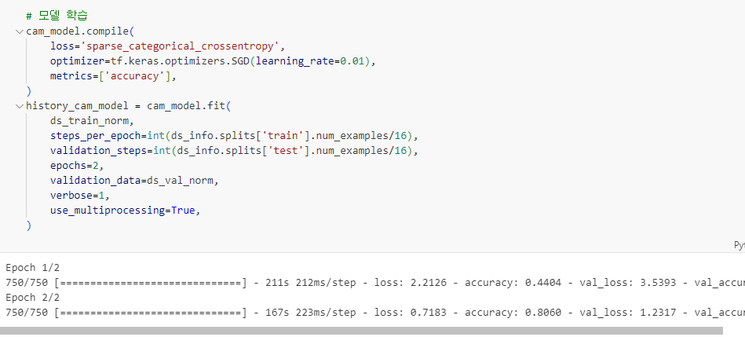
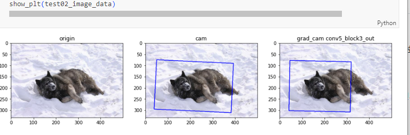
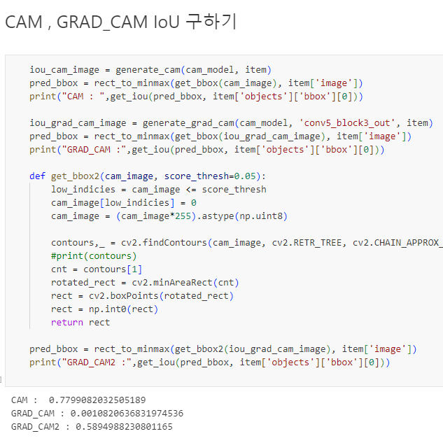
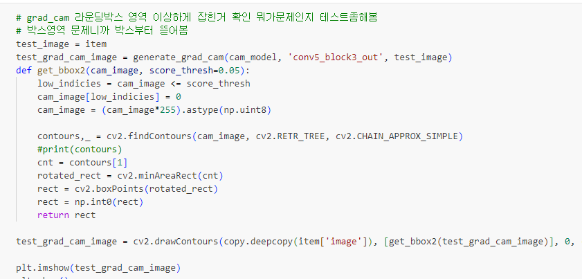
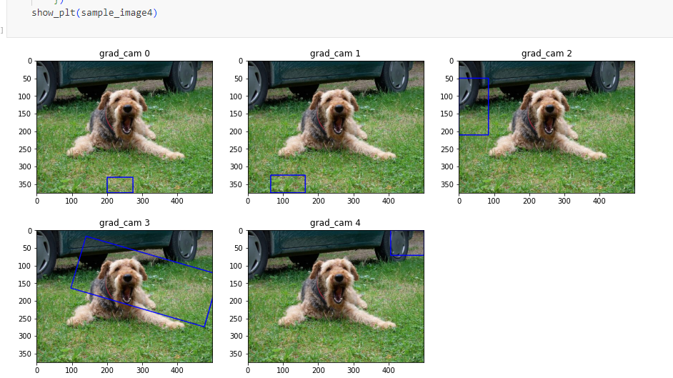
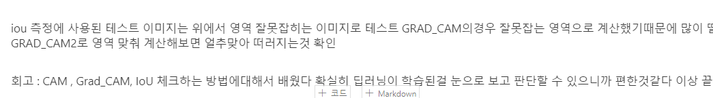
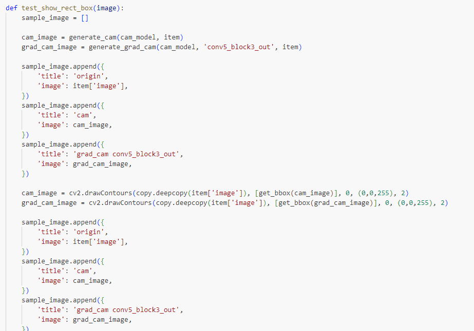

# AIFFEL Campus Online Code Peer Review Templete
- 코더 : 윤진환
- 리뷰어 : 윤여원

평가문항	상세기준
1. 한국어 전처리를 통해 학습 데이터셋을 구축하였다.	공백과 특수문자 처리, 토크나이징, 병렬데이터 구축의 과정이 적절히 진행되었다.
2. 트랜스포머 모델을 구현하여 한국어 챗봇 모델 학습을 정상적으로 진행하였다.	구현한 트랜스포머 모델이 한국어 병렬 데이터 학습 시 안정적으로 수렴하였다.
3. 한국어 입력문장에 대해 한국어로 답변하는 함수를 구현하였다.	한국어 입력문장에 맥락에 맞는 한국어로 답변을 리턴하였다.

# PRT(Peer Review Template)
- [x]  **1. 주어진 문제를 해결하는 완성된 코드가 제출되었나요?**
        
        
        


- [x]  **2. 전체 코드에서 가장 핵심적이거나 가장 복잡하고 이해하기 어려운 부분에 작성된 
주석 또는 doc string을 보고 해당 코드가 잘 이해되었나요?**
    - 해당 코드 블럭에 doc string/annotation이 달려 있는지 확인
    - 해당 코드가 무슨 기능을 하는지, 왜 그렇게 짜여진건지, 작동 메커니즘이 뭔지 기술.
    - 주석을 보고 코드 이해가 잘 되었는지 확인
        - 잘 작성되었다고 생각되는 부분을 캡쳐해 근거로 첨부합니다.
        

- [x]  **3. 에러가 난 부분을 디버깅하여 문제를 “해결한 기록을 남겼거나” 
”새로운 시도 또는 추가 실험을 수행”해봤나요?**
    - 문제 원인 및 해결 과정을 잘 기록하였는지 확인
    - 문제에서 요구하는 조건에 더해 추가적으로 수행한 나만의 시도, 
    실험이 기록되어 있는지 확인
        - 잘 작성되었다고 생각되는 부분을 캡쳐해 근거로 첨부합니다.
        
     
- [x]  **4. 회고를 잘 작성했나요?**
    - 주어진 문제를 해결하는 완성된 코드 내지 프로젝트 결과물에 대해
    배운점과 아쉬운점, 느낀점 등이 기록되어 있는지 확인
    - 전체 코드 실행 플로우를 그래프로 그려서 이해를 돕고 있는지 확인
        - 잘 작성되었다고 생각되는 부분을 캡쳐해 근거로 첨부합니다.
        
    
- [x]  **5. 코드가 간결하고 효율적인가요?**
    - 파이썬 스타일 가이드 (PEP8) 를 준수하였는지 확인
    - 하드코딩을 하지않고 함수화, 모듈화가 가능한 부분은 함수를 만들거나 클래스로 짰는지
    - 코드 중복을 최소화하고 범용적으로 사용할 수 있도록 함수화했는지
        - 잘 작성되었다고 생각되는 부분을 캡쳐해 근거로 첨부합니다.
        


# 참고 링크 및 코드 개선
```
# 코드 리뷰 시 참고한 링크가 있다면 링크와 간략한 설명을 첨부합니다.
# 코드 리뷰를 통해 개선한 코드가 있다면 코드와 간략한 설명을 첨부합니다.
```
